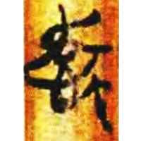
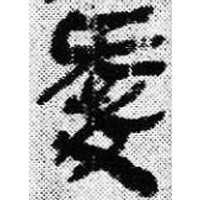
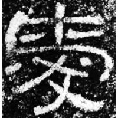
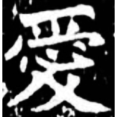
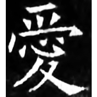

+++
radical = "61"
weight = 1
+++

| Zhanguo (Chu) | Zhanguo (Chu) | Qin | W.Han | E.Han | Nanbei (N.Wei) | Tang |
| ----- | ----- | ----- | ----- | ----- | ----- | ----- |
|  |  |  |  |  |  |  |
| 清一.程寤9 [㤅] | 上一.孔15 | 睡.日乙82 | 北.老154 | 西狹頌 | 元斌墓誌 | 開石.周易3 |

{愛} \*qˤə[p]s "to love"

[心](https://panatesu.github.io/glyph-origins/radicals/61/#U%2b5FC3) *HEART* + ♪[旡](https://panatesu.github.io/glyph-origins/radicals/71/#U%2b65E1). Later decorative 夂 was added to [旡](https://panatesu.github.io/glyph-origins/radicals/71/#U%2b65E1).

- 陳劍 2011 - 孔家坡漢簡的“祟”字
- 禤健聰 2016 - 楚簡文字與《說文》互證舉例

**Forms:**

[爱](https://panatesu.github.io/glyph-origins/radicals/87/#U%2b7231) - Shortening based on the cursive form. Modern simplified form in China.
