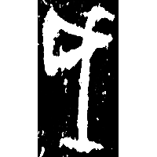
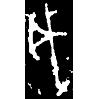
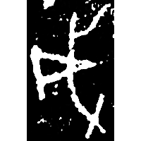
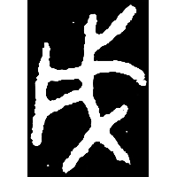
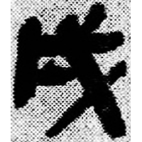
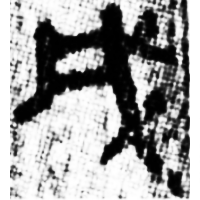
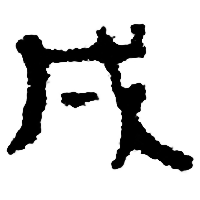
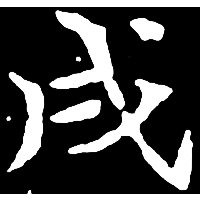

+++
radical = "62"
weight = 1
+++

| Shang (Bin) | Shang (Zi) | Shang (Huang) | Middle W.Zhou | Late W.Zhou | Qin | W.Han | E.Han | Nanbei (N.Wei) | Tang |
| ----- | ----- | ----- | ----- | ----- | ----- | ----- | ----- | ----- | ----- |
|  |  |  |  |  |  |  |  |  |  |
| 合7144正 | 合21784 | 合38024 | 集4316 | 集9731.1 | 睡.日乙26 | 銀二1992 | 文物2002.12 | 寇慰墓誌 | 開石.春左2 |

{戌} \*\[sV.m\]i\[t\] "*type of a battle axe*" ♪→ {戌} \*sV.mi\[t\] "*xu* (11th eartly branch)"

Depiction of a battle axe.

- 季旭昇 2014 - 說文新證 \[2nd ed.\] (985)
