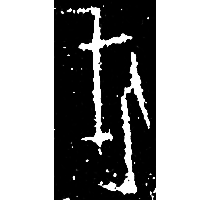
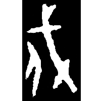
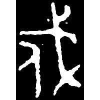
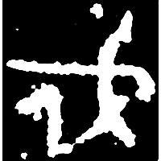
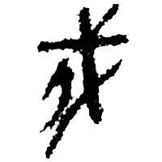
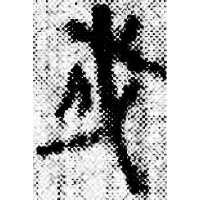
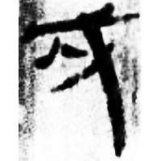
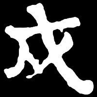
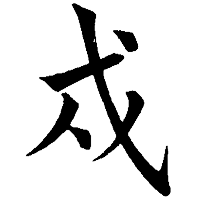
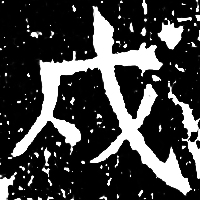

+++
radical = "62"
weight = 1
+++

| Shang (Chu) | Shang (He) | Middle W.Zhou | Middle W.Zhou | Qin | Qin | W.Han | Nanbei (N.Wei) | Tang | Yuan | Ming |
| ----- | ----- | ----- | ----- | ----- | ----- | ----- | ----- | ----- | ----- | ----- |
|  |  |  |  |  |  |  |  |  |  |  |
| 合25877 | 合27970 | 集5420.1 | 集2820 | 里J1⑨1正 | 里8-2246 | 張.二186 | 張寧墓誌 | 五經文字 | 元0154D | 洪武正韻 |

{戍} \*\[C̥.n\]os "to guard the border"

A person ([人](https://panatesu.github.io/glyph-origins/radicals/9/#U%2b4EBA)) with a glaive ([戈](https://panatesu.github.io/glyph-origins/radicals/62/#U%2b6208)) on his back.

- 季旭昇 2014 - 說文新證 \[2nd ed.\] (863-864)
