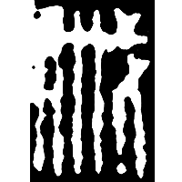
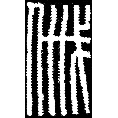
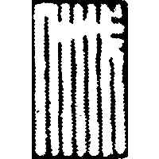
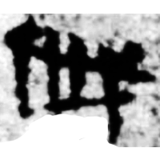
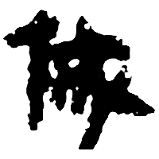
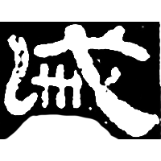
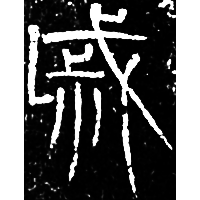
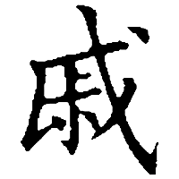
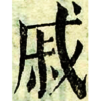

+++
radical = "62"
weight = 1
+++

| Qin | Han | Han | W.Han | W.Han | E.Han | Sanguo (Wei) | Nanbei (N.Wei) | Tang | Ming |
| ----- | ----- | ----- | ----- | ----- | ----- | ----- | ----- | ----- | ----- |
|  |  |  |  |  |  |  |  |  |  |
| 十鐘3.26上 | 雋124.11 | 印原205頁 | 馬.五65 [慼] | 尹YM6D2A | 夏承碑 [慼] | 正始石經 | 元文墓誌 | 五經文字 | 字彙 |

{戚} \*\[tsʰ\]ˤiwk "relatives"

[人](https://panatesu.github.io/glyph-origins/radicals/9/#U%2b4EBA) *PERSON* + ♪[𢦫](https://panatesu.github.io/glyph-origins/radicals/62/#U%2b229AB) \*TSIWK.

- 林澐 1989 - 說戚、我
- 陳劍 2007 - 說殷墟甲骨文中的“玉戚”
- 董蓮池 & 徐善飛 2015 - 戚姬簋的“戚”字研究兼說《說文》中的“戚”
