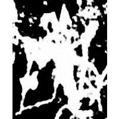
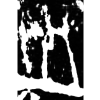
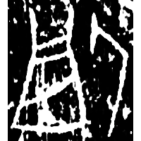
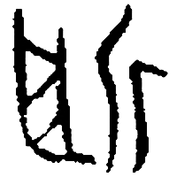
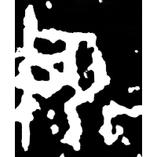
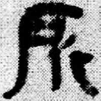
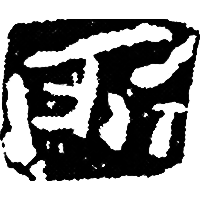
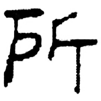
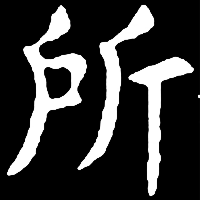
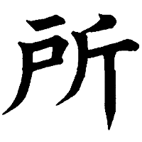

+++
radical = "63"
weight = 1
+++

| Shang (Shi) | Shang (Bin) | Shang (Wuming) | Late W.Zhou | Chunqiu (Qin) | Qin | W.Han | E.Han | Nanbei (N.Wei) | Tang |
| ----- | ----- | ----- | ----- | ----- | ----- | ----- | ----- | ----- | ----- |
|  |  |  |  |  |  |  |  |  |  |
| 合19875 | 合13874正甲 | 合31726 | 集4323 | 石鼓.作原 | 睡.爲24 | 考古2000.6 | 文物2002.12 | 鄭黑墓誌 | 五經文字 |

?{所(所)} \*\[C̥.ŋ\]raʔ(\[C̥.ŋ\]raʔ) "chop-chop" ♪→ {所} \*\[C̥.ŋ\]raʔ "place"

Depiction of hitting a scapula ([⿻𠃌𠃊](https://panatesu.github.io/glyph-origins/radicals/215/#%E2%BF%BB%F0%A0%83%8C%F0%A0%83%8A)) with an axe ([斤](https://panatesu.github.io/glyph-origins/radicals/69/#U%2b65A4)).

- 何景成 2008 - 釋“花東”卜辭的“所”
- 張富海 2017 - 據古文字論“色”“所”“疋”三字的上古聲母
