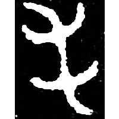
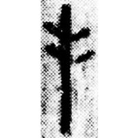
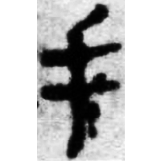
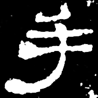
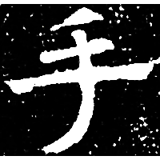
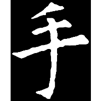

+++
radical = "64"
weight = 1
+++

| Early W.Zhou | Late W.Zhou | Qin | W.Han | E.Han | Nanbei (N.Qi) | Tang |
| ----- | ----- | ----- | ----- | ----- | ----- | ----- |
|  |  |  |  |  |  |  |
| 集4237 | 集4294 | 里耶8-76背 | 馬.五40 | 史晨碑 | 竇泰墓誌 | 五九樣10 |

?{手} \*C̥.luʔ "hand" / ?{莠} \*\[l\]uʔ "foxtail millet" ♪→ {手} \*C̥.luʔ "hand"

Uncertain. Probably either depiction of a hand for the word {手} or a depiction of foxtail millet for the word {莠}.

- 季旭昇 2014 - 說文新證 \[2nd ed.\] (844)
