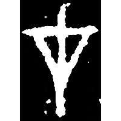
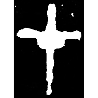
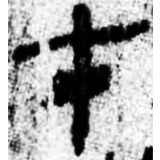
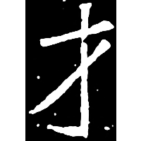
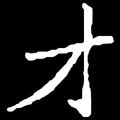

+++
radical = "64"
weight = 1
+++

| Shang (Shi) | Shang (Shi) | Shang (Bin) | Shang (Huang) | Middle W.Zhou | Qin | W.Han | W.Jin | Nanbei (N.Wei) | Nanbei (N.Wei) |
| ----- | ----- | ----- | ----- | ----- | ----- | ----- | ----- | ----- | ----- |
|  |  |  |  |  |  |  |  |  |  |
| 合19946反 [弋] | 合5430 | 合2940 | 合35589 | 集4626 | 近出1255 | 銀二1515 | 石尠墓誌 | 元秀墓誌 | 鄭君妻墓誌 |

{才} \*\[dz\]ˁə "talent"

Differentiated form of [弋](https://panatesu.github.io/glyph-origins/radicals/56/#U%2b5F0B) \*LƏK. The phonetic relationship is unknown.

- 陳劍 2006 - 釋造
- 季旭昇 2017 - 從出土材料談「才」字——兼談《易經》「三才」
- 季旭昇 2014 - 說文新證 \[2nd ed.\] (495-496)
