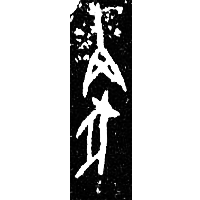
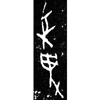
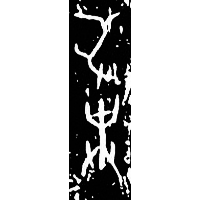
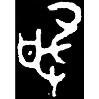
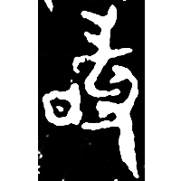
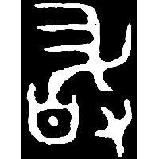
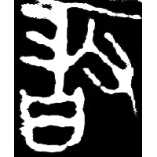
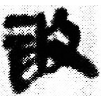
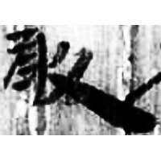
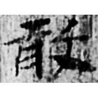

+++
radical = "66"
weight = 1
+++

| Shang (Bin) | Shang (Bin) | Shang (Wuming) | Early W.Zhou | Early W.Zhou | Middle W.Zhou | Zhanguo (Qin) | Qin | Qin | E.Han | E.Han | Nanbei (N.Wei) |
| ----- | ----- | ----- | ----- | ----- | ----- | ----- | ----- | ----- | ----- | ----- | ----- |
|  |  |  |  |  |  |  |  |  |  |  |  |
| 合10719 | 合224 | 合31133 | 近出943 | 集9901.1 | 集4252.1 | 駰乙.正 | 秦風157 | 睡.抄15 | 五.行326 | 五.木牘315 | 元壽安墓誌 |

{掩} \*\[q\]ramʔ "to make a surprise attack"　♪→ {敢} \*\[k\]ˤamʔ "to dare"

Depiction of a pig ([豕](https://panatesu.github.io/glyph-origins/radicals/152/#U%2b8C55)) being catched by a net ([𰅱](https://panatesu.github.io/glyph-origins/radicals/24/#U%2b30171)) in a hand ([又](https://panatesu.github.io/glyph-origins/radicals/29/#U%2b53C8)).

- 丁驌 1985 - 讀契記
- 陳絜 2006 - 說“敢”
- 宋雅萍 2011 - 說甲骨文、金文的“敢”字
- 謝明文 2012 - 商代金文的整理與研究 (271)
- 黃天樹 2015 - 甲骨卜辭中關於商代城邑的史料
- 陳劍 2020 - “尋‘詞’推‘字’”之一例——試說殷墟甲骨文中“犯”“圍”兩讀之字
