+++
radical = "70"
weight = 1
+++

| Early W.Zhou | Early W.Zhou | Late W.Zhou | Chunqiu (Qi) | Chunqiu (Chu) | Zhanguo (Chu) | Zhanguo (Qin) | Qin | Qin | Qin | E.Han | Tang |
| ----- | ----- | ----- | ----- | ----- | ----- | ----- | ----- | ----- | ----- | ----- | ----- |
|  | 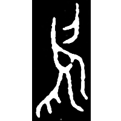 | 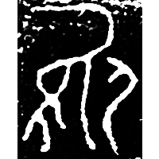 | 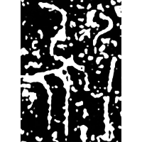 | 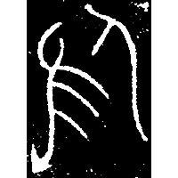 | 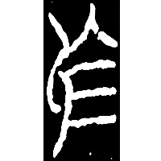 | 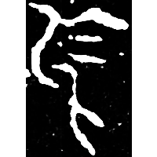 | 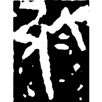 | 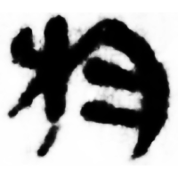 | 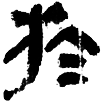 | 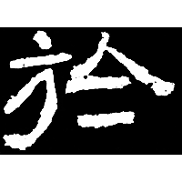 | 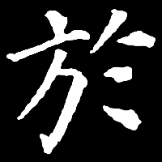 |
| 集5429.1 [烏] | 集5428.1 [烏] | 集11757 [烏] | 集271 | 集38 | 集12113 | 二世詔版4 | 秦銘131 | 睡.語1 | 北.從政 | 張遷碑 | 唐多寶塔碑 |

{於} \*[ʔ]a "in; at; on"

Differentiated form of [烏](https://panatesu.github.io/glyph-origins/radicals/86/#U%2b70CF) \*ɁA.

- 季旭昇 2014 - 說文新證 [2nd ed.] (309-310)
