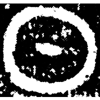
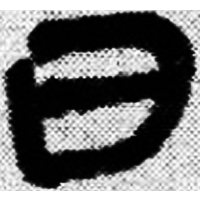
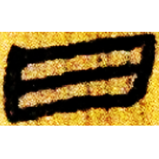
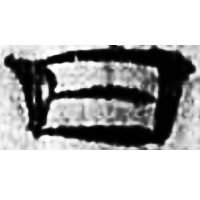
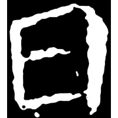
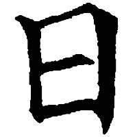

+++
radical = "72"
weight = 1
+++

| Shang | Shang (Bin) | Middle W.Zhou | Qin | W.Han | E.Han | Nanbei (N.Wei) | Tang |
| ----- | ----- | ----- | ----- | ----- | ----- | ----- | ----- |
|  |  |  |  |  |  |  |  |
| 集5350.1 | 合6571正 | 考文2006.6 | 睡.日乙26 | 北.周Z1 | 五.行231 | 元敷墓誌 | 五經文字 |

{日} \*kV.nik "sun"

Depiction of the sun.

- 季旭昇 2014 - 說文新證 \[2nd ed.\] (531)
