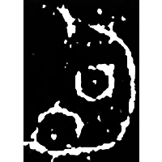
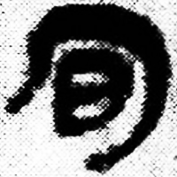
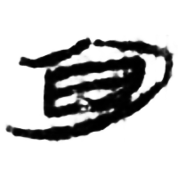
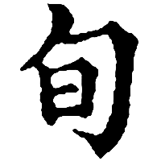

+++
radical = "72"
weight = 1
+++

| Early W.Zhou | Middle W.Zhou | Qin | W.Han | E.Han | Tang |
| ----- | ----- | ----- | ----- | ----- | ----- |
|  |  |  |  |  |  |
| 集2682 | 集5430.2 | 睡.種74 | 北.妄47 | 夏承碑 | 五經文字 |

{旬} \*\[sN.qʷ\]i\[n\] "ten days"

[日](https://panatesu.github.io/glyph-origins/radicals/72/#U%2b65E5) *DAY* + ♪[〾勹](https://panatesu.github.io/glyph-origins/radicals/215/#%E3%80%BE%E5%8B%B9) \*QʷIN  (\> 勹).

- 裘錫圭 1990 - 殷墟甲骨文字考釋(七篇)・五、釋勻
- 鄔可晶 2019 - 說“回”
- 張卉、呉毅強 2024 - 甲骨文舊釋“蜀”字平議兼論“旬”字構形

