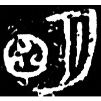
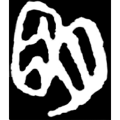
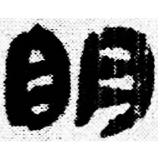

+++
radical = "72"
weight = 1
+++

| Shang | Shang (Bin) | Early W.Zhou | Chunqiu (Qin) | Zhanguo (Qin) | Zhanguo (Qin) | Qin | E.Han | E.Han | Nanbei (N.Wei) |
| ----- | ----- | ----- | ----- | ----- | ----- | ----- | ----- | ----- | ----- |
|  |  |  |  |  |  |  |  |  |  |
| 近出241 | 合14正 | 集6015 | 集4315 | 駰乙.正 | 集證26.2 | 睡.日乙206 | 肥致碑 | 淳于長夏承碑 | 南0021X |

{明} \*mraŋ "bright"

[月](https://panatesu.github.io/glyph-origins/radicals/74/#U%2b6708) *MOON* + ♪[囧](https://panatesu.github.io/glyph-origins/radicals/31/#U%2b56E7) \*MRAŊ (> 目 > 日).

- 蘇建洲 2019 - 《清華大學藏戰國竹簡(捌)》字詞考釋十則
