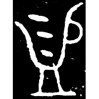
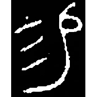
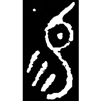
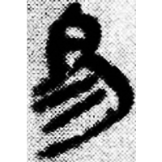
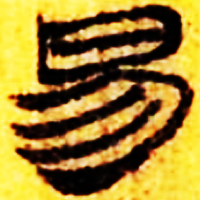
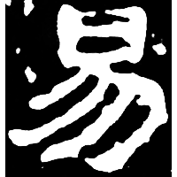

+++
radical = "72"
weight = 1
+++

| Shang (Shi-Li) | Shang (Bin) | Early W.Zhou | Early W.Zhou | Middle W.Zhou | Middle W.Zhou | Qin | W.Han | E.Han | Tang |
| ----- | ----- | ----- | ----- | ----- | ----- | ----- | ----- | ----- | ----- |
|  |  |  |  |  |  |  |  |  |  |
| 合32226 | 合811正 | 集2405 | 集2459 | 集4171.1 | 集4291 | 睡.效44 | 北.老72 | 太尉楊震碑 | 五經文字 |

{賜} \*sV.leks "to bestow" ♪→ {易} \*lek "to change"

Depiction of water being poured from a tilted vessel.

- 謝明文 2019 - 甲骨文舊釋“益”之字新釋——兼“易”字新探
