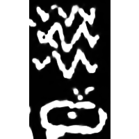
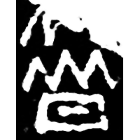
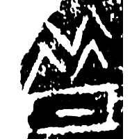
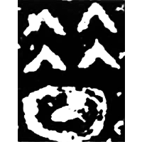
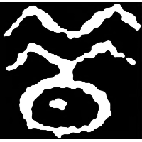
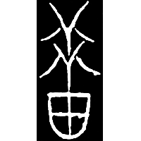
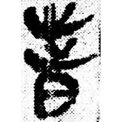
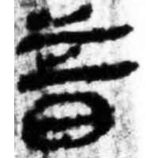
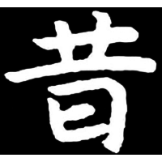

+++
radical = "72"
weight = 1
+++

| Shang (Zi) | Shang (Bin) | Shang (Bin) | Early W.Zhou | Late W.Zhou | Zhanguo (Jin) | Qin | W.Han | E.Han | Nanbei (N.Wei) |
| ----- | ----- | ----- | ----- | ----- | ----- | ----- | ----- | ----- | ----- |
|  |  |  |  |  |  |  |  |  |  |
| 花35 | 懷1004 | 合7213 | 集6014 | 華章119頁 | 集2840 | 睡.日乙120 | 張.引13 | 張君碑 | 元謐墓誌 |

{昔} \*\[s\]ak "the past"

[日](https://panatesu.github.io/glyph-origins/radicals/72/#U%2b65E5) *DAY* + ♪[𠈌](https://panatesu.github.io/glyph-origins/radicals/9/#U%2b2020C)² \*(T)SAK (depiction of cracks for {皵} \*tsʰak "to crack").

- 陳劍 2021 - 說「昔」字並論「𡿧」形的真正來源
