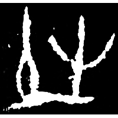
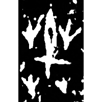
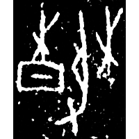
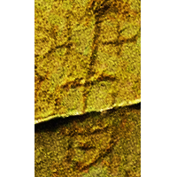
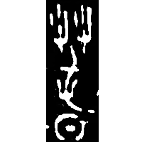
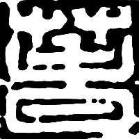
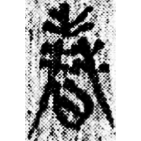
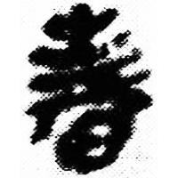
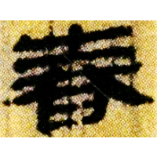
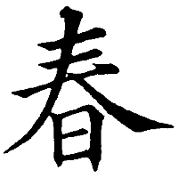

+++
radical = "72"
weight = 1
+++

| Shang (Shi) | Shang (Bin) | Shang (Bin) | W.Zhou | Chunqiu (Zheng) | Qin | Qin | Qin | W.Han | E.Han | Tang |
| ----- | ----- | ----- | ----- | ----- | ----- | ----- | ----- | ----- | ----- | ----- |
|  |  |  |  |  |  |  |  |  |  |  |
| 合20074 [芚] | 合2358正 [芚] | 合11533 | H11:75 | 近二878 | 封泥集.附二404 | 里耶8-1725 | 睡.日乙111 | 北.雨Z2 | 華山廟碑 | 五經文字 |

{春} \*tʰu\[r\] "spring"

[日](https://panatesu.github.io/glyph-origins/radicals/72/#U%2b65E5) *SUN* + ♪[芚](https://panatesu.github.io/glyph-origins/radicals/140/#U%2b829A) \*TU\[R\]. Initially the word {春} was written phonetically as [屯](https://panatesu.github.io/glyph-origins/radicals/45/#U%2b5C6F) \*TU\[R\] or [芚](https://panatesu.github.io/glyph-origins/radicals/140/#U%2b829A).

- 蔣玉斌 2018 -釋釈甲骨金文的“蠢”兼論相關問題
