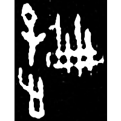
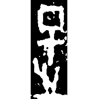
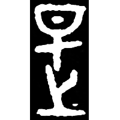
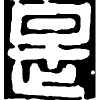
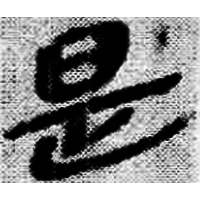
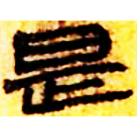
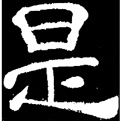
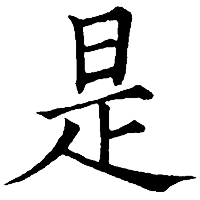

+++
radical = "72"
weight = 1
+++

| Shang (Wuming) | Shang (Bin) | Early W.Zhou | Chunqiu (Qin) | Qin | Qin | W.Han | E.Han | Tang |
| ----- | ----- | ----- | ----- | ----- | ----- | ----- | ----- | ----- |
|  |  |  |  |  |  |  |  |  |
| 合30692 | 合456正 | 集2724 | 集證59 | 秦印編30 | 睡.問188 | 北.老17 | 夏承碑 | 干祿字書 |

?{鞮} \*tˤe "leather shoes" ♪→ {是} \*\[d\]eʔ "this"

[止](https://panatesu.github.io/glyph-origins/radicals/77/#U%2b6B62) *FOOT* + shortened ♪[智](https://panatesu.github.io/glyph-origins/radicals/72/#U%2b667A) \*TE.

- 范天培 2020 - 清華大學藏戰國竹簡(肆)～(柒)字根研究
