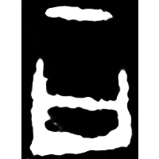
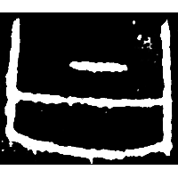
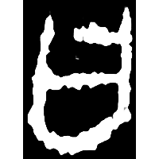
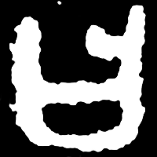
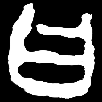
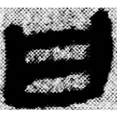
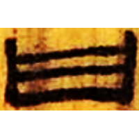
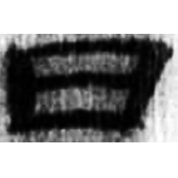
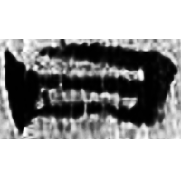
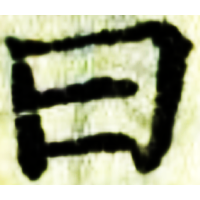

+++
radical = "73"
weight = 1
+++

| Shang (Shi) | Shang (Bin) | Shang (Huang) | Middle W.Zhou | Zhanguo (Qin) | Qin | W.Han | E.Han | E.Han | Nanbei (N.Wei) | Tang | Ming |
| ----- | ----- | ----- | ----- | ----- | ----- | ----- | ----- | ----- | ----- | ----- | ----- |
|  |  |  |  |  |  |  |  |  |  |  |  |
| 合20315 | 合562反 | 合37868 | 集2696 | 駰乙.正 | 睡.爲23 | 北.老86 | 五.行383 | 五.行227 | 笱景墓誌 | 五經文字 | 洪武正韻 |

{曰} \*\[w\]at “to say”

Depiction of a mouth ([口](https://panatesu.github.io/glyph-origins/radicals/30/#U%2b53E3)) with a dot/line over it, representing the sound coming from it.

- 季旭昇 2014 - 說文新證 [2nd ed.] (386-387)
