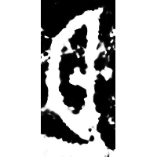
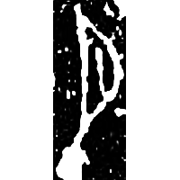
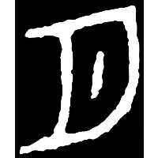
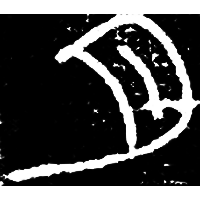
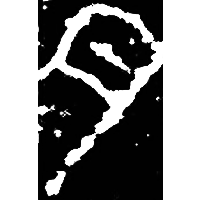
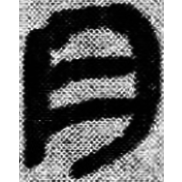
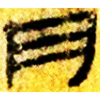
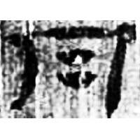
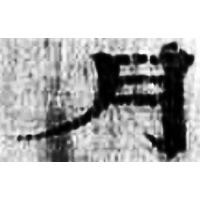
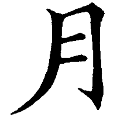

+++
radical = "74"
weight = 1
+++

| Shang (Shi) | Shang (Wuming) | Early W.Zhou | Early W.Zhou | Chunqiu (Qin) | Zhanguo (Qin) | Zhanguo (Qin) | Qin | W.Han | E.Han | E.Han | Tang |
| ----- | ----- | ----- | ----- | ----- | ----- | ----- | ----- | ----- | ----- | ----- | ----- |
|  |  |  |  |  |  |  |  |  |  |  |  |
| 合20924 | 屯873 [霸] | 集6015 [明] | 集2661 | 集證67 | 秦陶1610 | 青川木牘 | 睡.日乙101 | 北.雨Z1 | 五.行88B | 五.行209A | 五經文字 |

{夕} \*sə.lak "night" & {月} \*ŋʷat "moon"

[夕](https://panatesu.github.io/glyph-origins/radicals/36/#U%2b5915) + differentiative dot. Initially [夕](https://panatesu.github.io/glyph-origins/radicals/36/#U%2b5915) was used for both words {月} and {夕}. Later 月 appeared and began to be used for {夕}. Later it began to be used for {月}.

- 陳劍 2007 - 甲骨金文考釋論集・殷墟卜辭的分期分類對甲骨文字考釋的重要性
- 季旭昇 2014 - 說文新證 \[2nd ed.\] (548-549)
- 裘錫圭 2013 - 文字學概要 \[2nd ed.\] \[2021 form.\] (7-8, 169)
