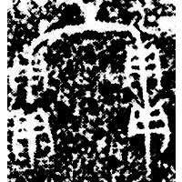
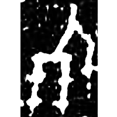
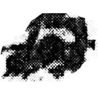
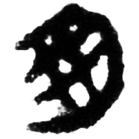
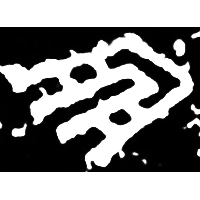

+++
radical = "74"
weight = 1
+++

| Shang | Shang (Shi) | Shang (Bin) | Early W.Zhou | Late W.Zhou | Qin | W.Han | E.Han | Nanbei (N.Wei) | Nanbei (E.Wei) | Ming | Qing |
| ----- | ----- | ----- | ----- | ----- | ----- | ----- | ----- | ----- | ----- | ----- | ----- |
|  |  |  |  |  |  |  |  |  |  |  |  |
| 集9808 [玨] | 合11445 [玨] | 合13 | 集3667 | 集2835 | 睡.種125 [傰] | 馬.易44上 | 熹237 | 元靈曜墓誌 | 李挺墓誌 | 洪武正韻 | 內本康熙 |

{朋} \*[b]ˤəŋ "friend"

[人](https://panatesu.github.io/glyph-origins/radicals/9/#U%2b4EBA) *PERSON* + ♪[玨](https://panatesu.github.io/glyph-origins/radicals/96/#U%2b73A8)² \*PƏŊ.

- 黃文傑 2000 - 說朋
- 李家浩 2013 - 《說文》篆文有漢代小学家簒改和虛造的字形
