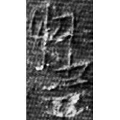
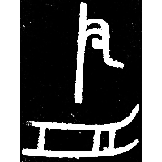
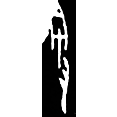
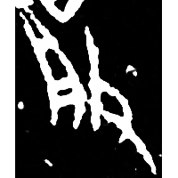
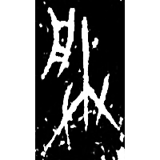
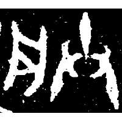
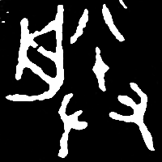
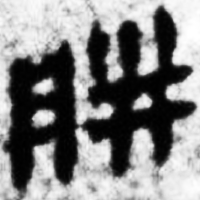
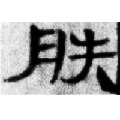

+++
radical = "74"
weight = 1
+++

| Shang (Shi) | Shang | Shang | Shang (Shi) | Shang (Ya) | Shang (Bin) | Early W.Zhou | Late W.Zhou | Zhanguo (Chu) | W.Han | E.Han | Tang |
| ----- | ----- | ----- | ----- | ----- | ----- | ----- | ----- | ----- | ----- | ----- | ----- |
|  |  |  |  |  |  |  |  |  |  |  |  |
| 合20619 | H11:84 | 集3106 | 合20610 | 合22307 | 合5016 | 集4205 | 集10244 | 清八.攝命28 | 馬.經10下 | 杖書9 | 唐1404C |

{䑣} \*C̥.lrəm "to go (about a boat)" ♪→ {朕} \*lrəmʔ "I, me"

Depiction of a person pushing a boat ([舟](https://panatesu.github.io/glyph-origins/radicals/137/#U%2b821F) \> 月) with a pole.

- 鄔可晶 & 施瑞峰 2022 - 說“朕”“灷”
