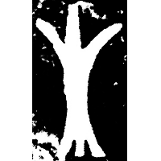
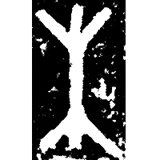
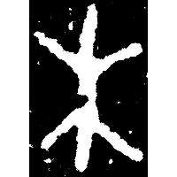
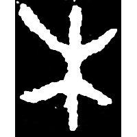
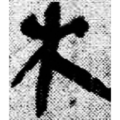
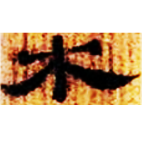
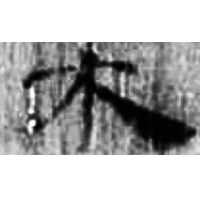
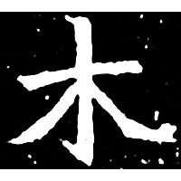

+++
radical = "75"
weight = 1
+++

| Shang | Shang | Shang | Late W.Zhou | Qin | W.Han | E.Han | Nanbei (N.Wei) |
| ----- | ----- | ----- | ----- | ----- | ----- | ----- | ----- |
|  |  |  |  |  |  |  |  |
| 集4864.2 | 集8209 | 集5166.1 | 集10176 | 睡.日乙81 | 北.老107 | 五.行345 | 南0166X |

{木} \*CV.mˤok "tree" & {生} \*sreŋ "to grow"

Depiction of a tree. Initially it was used for both words {木} and {生}. Later it began to be used only for {木}.

- 季旭昇 2014 - 說文新證 \[2nd ed.\] (484)
- 裘錫圭 1988 - 釋“木月”“林月”
- 陳劍 2022 - 卜辭{凶}詞覓蹤
