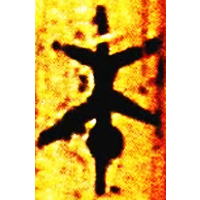
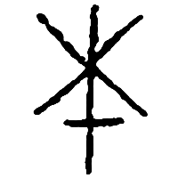
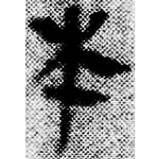
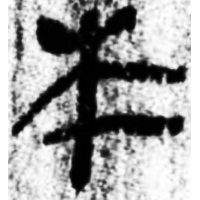
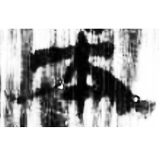
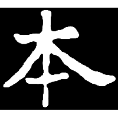
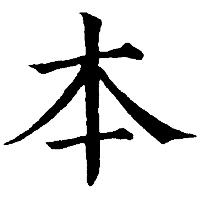

+++
radical = "75"
weight = 1
+++

| Zhanguo (Chu) | Zhanguo (Qi) | Qin | W.Han | E.Han | Nanbei (N.Wei) | Tang |
| ----- | ----- | ----- | ----- | ----- | ----- | ----- |
|  |  |  |  |  |  |  |
| 上一.孔16 | 錢典963 | 睡.種38 | 銀二1421 | 五.楬70B | 南0357X | 干祿字書 |

{本} \*C.pˤə\[n\]ʔ "root"

Depiction of a tree ([木](https://panatesu.github.io/glyph-origins/radicals/75/#U%2b6728)) with an indicative dot on its roots.

- 季旭昇 2014 - 說文新證 [2nd ed.] (484-485)
