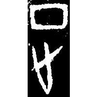
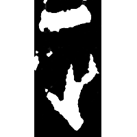
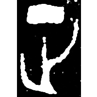
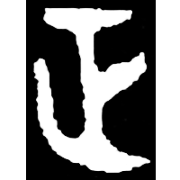
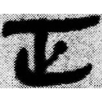
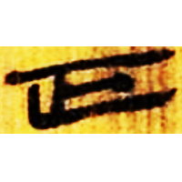

+++
radical = "77"
weight = 1
+++

| Shang (Bin) | Shang (Huang) | Early W.Zhou | Middle W.Zhou | Qin | W.Han | E.Han | E.Han | Nanbei (N.Wei) |
| ----- | ----- | ----- | ----- | ----- | ----- | ----- | ----- | ----- |
|  |  |  |  |  |  |  |  |  |
| 合6810 | 合36489 | 集5244.2 | 集4289.2 | 睡.效7 | 北.老58 | 尹宙碑 | 楊震碑 | 南0237A |

{征} \*teŋ "to go on a punitive expedition" ♪→ {正} \*teŋs "correct"

 *FOOT* + ♪ \*TEŊ.

- 劉釗 2011 - 古文字構形學 \[2nd ed.\] (93)
