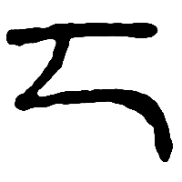
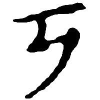
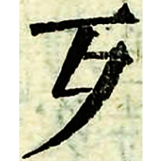
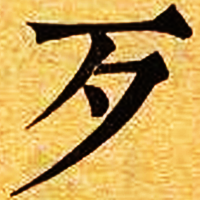

+++
radical = "78"
weight = 1
+++

#### 歹¹

Shortening of [死](https://panatesu.github.io/glyph-origins/radicals/78/#U%2b6B7B) used in compound glyphs as a semantic *DIE*.

#### 歹²

| Yuan | Yuan | Ming | Qing |
| ----- | ----- | ----- | ----- |
|  |  |  |  |
| 蒙古字韻 [ꡊ] | 南村綴耕錄 | 字彙 | 內本康熙 |

{歹} *꜂taj* "bad"

Graphical borrowing of the Tibetan letter ཏ /ta/ or ʼPhags-pa letter ꡊ /da/.

- 徐復 1944 - 𣦶字源出藏文說
- 李思純 1957 - 江村十論・說歹
- 路修遠 2017 - 「歹」字辨
