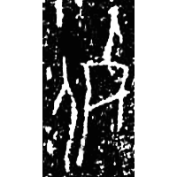
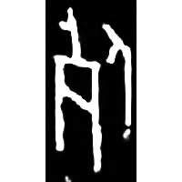
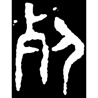
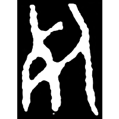
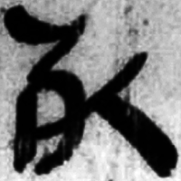
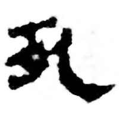
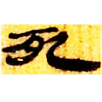
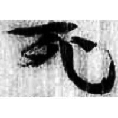
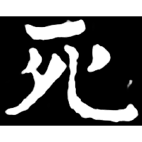
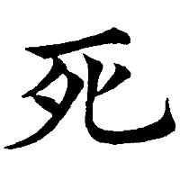

+++
radical = "78"
weight = 1
+++

| Shang (Yuanti) | Shang (Huadong) | Early W.Zhou | Late W.Zhou | Qin | W.Han | W.Han | E.Han | Nanbei (N.Wei) | Tang | Qing |
| ----- | ----- | ----- | ----- | ----- | ----- | ----- | ----- | ----- | ----- | ----- |
|  |  |  |  |  |  |  |  |  |  |  |
| 合21890 | 花21 | 集4179 | 集4438.2 | 睡.日乙150 | 馬.經19上 | 北.老101 | 五.木牘291B | 南0261X | 五經文字 | 內本康熙 |

{死} \*sijʔ "to die" (& {葬} \*tsˤaŋs "to bury")

Either  *SHOVEL* +  *PERSON* (created for {死}) or  *PERSON* + ♪ \*TSAŊ (created for {葬} and later began to be used for {死}; in early script some glyphs were used for both words {葬} and {死}).

- 張昂 2024 - 說“死”“葬”

**Forms:**

 - Shortening used in compound glyphs as a semantic.
