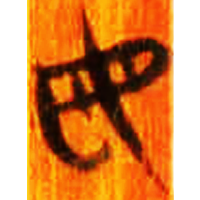
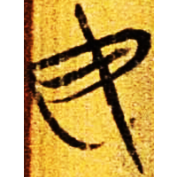
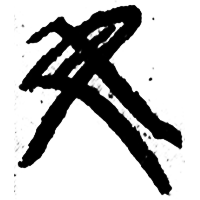
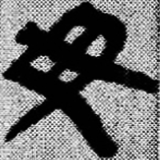
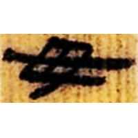
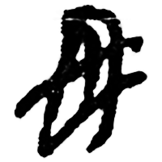
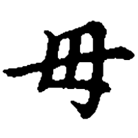
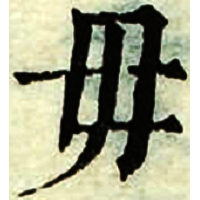

+++
radical = "80"
weight = 1
+++

| Zhanguo (Chu) | Zhanguo (Chu) | Qin | Qin | W.Han | E.Han | Tang | Ming |
| ----- | ----- | ----- | ----- | ----- | ----- | ----- | ----- |
|  |  |  |  |  |  |  |  |
| 清五.命訓4 [母] | 上三.彭祖8 | 嶽三68 | 睡.日乙144 | 北.老7 | 中國文物報1993.11 | 五經文字 | 字彙 |

{毋} \*m\[o\] "do not"

Differentiated form of [母](https://panatesu.github.io/glyph-origins/radicals/80/#U%2b6BCD) \*MƏ.

- 季旭昇 2014 - 說文新證 \[2nd ed.\] (854)
