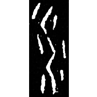
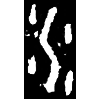
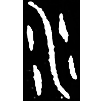
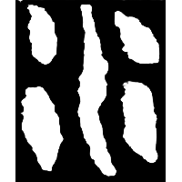
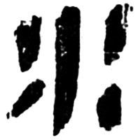
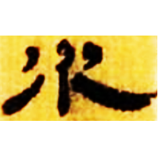
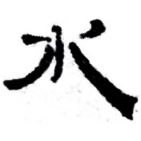
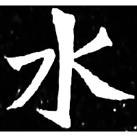

+++
radical = "85"
weight = 1
+++

| Shang (Shi) | Shang (Shi) | Shang (Bin) | Early W.Zhou | Chunqiu (Qin) | Qin | Qin | W.Han | Han | Han | Nanbei (N.Wei) |
| ----- | ----- | ----- | ----- | ----- | ----- | ----- | ----- | ----- | ----- | ----- |
|  |  |  |  |  |  |  |  |  |  |  |
| 合20615 | 合20660 | 合10151正 | 集4330 | 石鼓.吾水 | 陶錄6.204.1 | 北.白囊 | 北.老141 | 居舊274.36 | 肩73EJT33:71A | 南0091X |

{水} \*s.turʔ "water"

Abstract depiction of flowing water and water drops.

- 季旭昇 2014 - 說文新證 \[2nd ed.\] (795)
