+++
radical = "85"
weight = 1
+++

| Shang | Shang (Shi) | Shang (Shi) | Shang (Bin) | Middle W.Zhou | Qin | Qin | W.Han | E.Han | E.Han | Nanbei (N.Wei) | Tang |
| ----- | ----- | ----- | ----- | ----- | ----- | ----- | ----- | ----- | ----- | ----- | ----- |
| 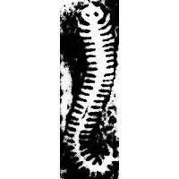 | 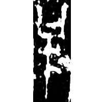 | 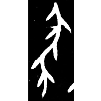 | 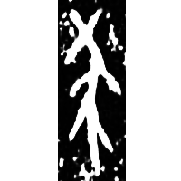 | 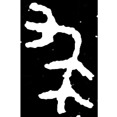 | 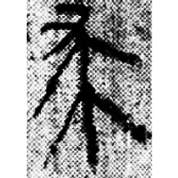 | 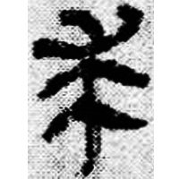 | 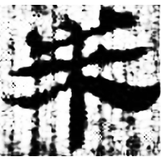 | 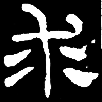 | 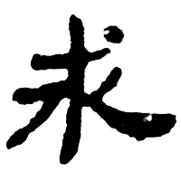 |  | 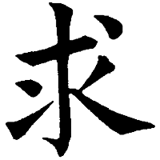 |
| 集7567 | 合21461 [⿲丨求丨] | 合21487 | 合14615 | 集4178 | 里耶8-296 | 睡.爲27 | 北.周93 | 華山廟碑 | 中國文物報1993.11 | 南0033X | 九經字樣 |

{蛷} \*\[ɡ\]u "centipede" ♪→ {求} \*\[ɡ\]u "to seek"

Depiction of a centipede.

- 唐蘭 1949 - 中國文字學 (64-65)
- 裘錫圭 1986 - 釋“求”
- 季旭昇 2014 - 說文新證 \[2nd ed.\] (896-897)
