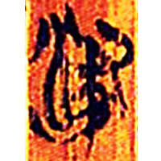
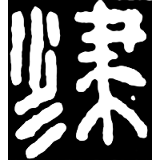
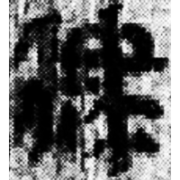
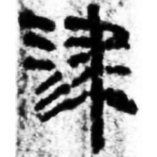
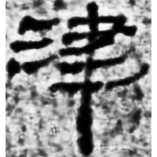
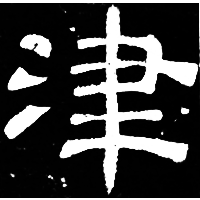
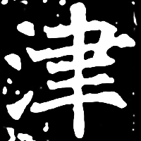

+++
radical = "85"
weight = 1
+++

| Zhanguo (Chu) | Qin | Qin | W.Han | Han | E.Han | Nanbei (E.Wei) |
| ----- | ----- | ----- | ----- | ----- | ----- | ----- |
|  |  |  |  |  |  |  |
| 清二.繫年132 | 秦風23 | 里8-651正 | 銀二1554 | 肩73EJT4:101 | 淳于長夏承碑 | 南0419X |

{津} \*\[ts\]i\[n\] "ford"

[水](https://panatesu.github.io/glyph-origins/radicals/85/#U%2b6C34) *WATER* + ♪[𦘔](https://panatesu.github.io/glyph-origins/radicals/129/#U%2b26614) \*TSIN (\> 聿).

- 林志強 & al. (ed.) 2017 - 《文源》評注 (607)
- 季旭昇 2014 - 說文新證 \[2nd ed.\] (218-219)
