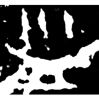
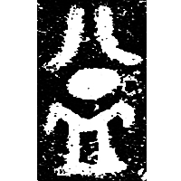
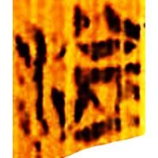
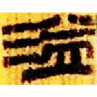
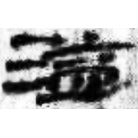
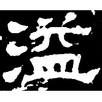
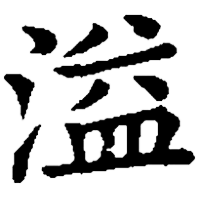
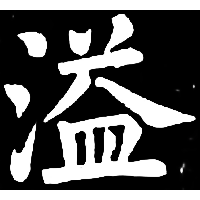

+++
radical = "85"
weight = 1
+++

| Shang (Bin) | Middle W.Zhou | Zhanguo (Chu) | W.Han | Han | E.Han | Tang | Ming |
| ----- | ----- | ----- | ----- | ----- | ----- | ----- | ----- |
|  |  |  |  |  |  |  |  |
| 合811正 [易] | 集10322 [易] | 清三.芮良夫9 [⿱溢皿] | 北.蒼30 | 肩73EJT31:44A+T30:55A | 漢0097X | 九經字樣 | 明0004X |

{溢} \*lik "to overflow"

[水](https://panatesu.github.io/glyph-origins/radicals/85/#U%2b6C34) *WATER* + ♪[易](https://panatesu.github.io/glyph-origins/radicals/72/#U%2b6613) \*LEK (\> 益).

- 謝明文 2019 - 甲骨文舊釋“益”之字新釋——兼“易”字新探
- 張鑫裕 2019 - 漢碑字詞零釋及相關問題研究・古文字中舊釋“益”之字新釋——兼說“益”“溢”非古今字
