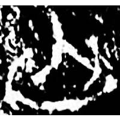
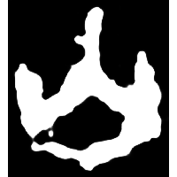
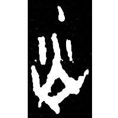
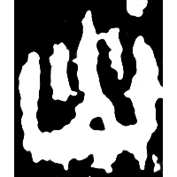
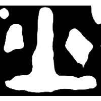
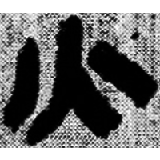
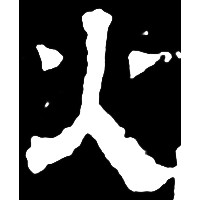

+++
radical = "86"
weight = 1
+++

| Shang (Bin) | Shang (Shi) | Shang (Wuming) | Shang (Wuming) | Early W.Zhou | Middle W.Zhou | Late W.Zhou | Qin | W.Han | E.Han | Tang |
| ----- | ----- | ----- | ----- | ----- | ----- | ----- | ----- | ----- | ----- | ----- |
|  |  |  |  |  |  |  |  |  |  |  |
| 合17066 | 合11550 | 合27317 | 合30774 | 集5416.1 [炎] | 近二438 [燹] | 第三屆321頁 [焂] | 睡.日乙113 | 北.蒼72 | 熹經290 [狄] | 九經字樣 |

{火} \*s.mˤəjʔ "fire"

Depiction of a flame. Later decorative dots were added (probably to differentiate it from [山](https://panatesu.github.io/glyph-origins/radicals/46/#U%2b5C71)).

- 季旭昇 2014 - 說文新證 \[2nd ed.\] (753)
