+++
radical = "86"
weight = 1
+++

| Shang (Shi) | Shang (Bin) | Early W.Zhou | Middle W.Zhou | Qin | Qin | Han | Han | W.Han | Han | Nanbei (N.Wei) | Tang |
| ----- | ----- | ----- | ----- | ----- | ----- | ----- | ----- | ----- | ----- | ----- | ----- |
| 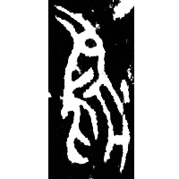 | 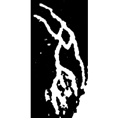 | 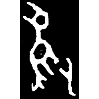 | 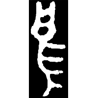 | 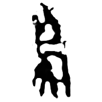 | 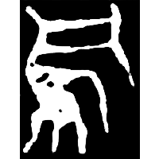 | 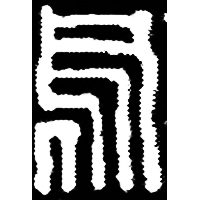 | 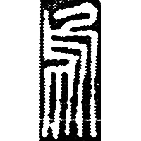 | 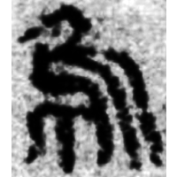 | 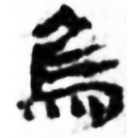 | 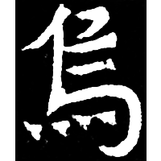 | 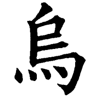 |
| 合20354 | 合3457 | 集5429.1 | 集2824 | 秦新1130 | 陶錄6.319.1 | 徵存656 | 薤書28.3 | 馬.胎27 | 武醫42 | 元悌墓誌 | 五經文字 |

{烏} \*[ʔ]ˤa "crow"

Depiction of a bird with its head tilted back and its beak wide open.

- 季旭昇 2014 - 說文新證 [2nd ed.] (309-310)

**Forms:**

[乌](https://panatesu.github.io/glyph-origins/radicals/4/#U%2b4E4C) - Shortening based on the cursive form. Modern simplified form in China.
