+++
radical = "86"
weight = 1
+++

| Shang | Shang (Bin) | Early W.Zhou | Middle W.Zhou | Zhanguo (Chu) | Zhanguo (Chu) | Zhanguo (Chu) | Qin | W.Han | E.Han | Nanbei (N.Wei) | Tang |
| ----- | ----- | ----- | ----- | ----- | ----- | ----- | ----- | ----- | ----- | ----- | ----- |
| 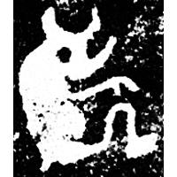 | 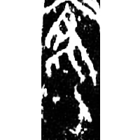 | 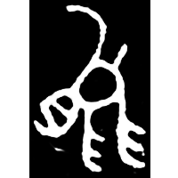 | 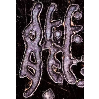 | 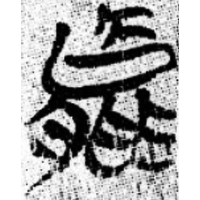 | 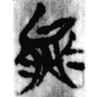 | 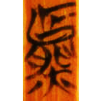 | 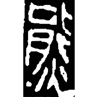 | 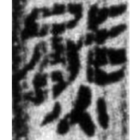 | 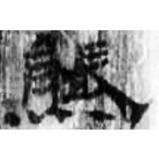 | 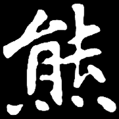 | 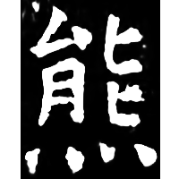 |
| 集6183 [能] | 合1112 [罷] | 集5984 [能] | 集10175 | 葛陵零2 | 包156 | 清七.晉文6 | 秦印編200 | 張.引101 | 五.行90 | 南0293X | 開石.爾雅4 |

{熊} \*\[t.w\]əm "bear" / {熊(熊)} \*\[t.w\]əm "flaming" ♪→ {熊} \*\[t.w\]əm "bear"

Initially the word {熊} "bear" was written as [能](https://panatesu.github.io/glyph-origins/radicals/130/#U%2b80FD) or a similar glyph (depiction of a bear). Later an unknown element was added (\> 大). The modern character comes either from the distortion 大 \> 火 with shifting it to the bottom, or from the shortening of the glyph [⿱⿱大能火](https://panatesu.github.io/glyph-origins/radicals/215/#%E2%BF%B1%E2%BF%B1%E5%A4%A7%E8%83%BD%E7%81%AB) ([火](https://panatesu.github.io/glyph-origins/radicals/86/#U%2b706B) *FIRE* + ♪⿱大能(熊) \*WƏM) for {熊(熊)} "flaming".

- 裘錫圭 2011 - “東皇太一”與“大⿱大能伏羲”
- 單育辰 2020 - 甲骨文所見動物研究 (42-46)
- 季旭昇 2014 - 說文新證 \[2nd ed.\] (752-753)

  
