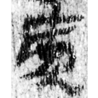
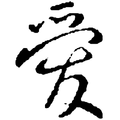
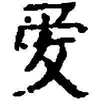
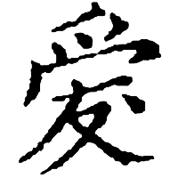

+++
radical = "87"
weight = 1
+++

| Han | Nanbei (N.Wei) | Tang | Jin | Yuan |
| ----- | ----- | ----- | ----- | ----- |
|  |  |  |  |  |
| 居140.004 | 高廣墓誌 | 太宗 | 劉知遠諸宮調 | 古列女傳 |

Shortening of [愛](https://panatesu.github.io/glyph-origins/radicals/61/#U%2b611B) based on the cursive form. Modern simplified form of [愛](https://panatesu.github.io/glyph-origins/radicals/61/#U%2b611B) in China.

- Bökset R. 2021 - Long Story of Short Forms: Simplified Chinese Characters from A to Z (36)
