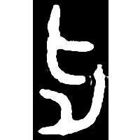
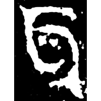
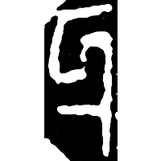
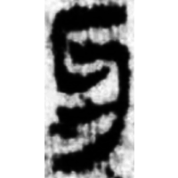
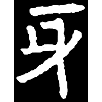
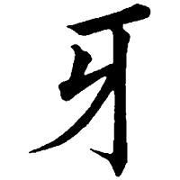
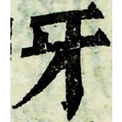

+++
radical = "92"
weight = 1
+++

| Middle W.Zhou | Late W.Zhou | Qin | W.Han | W.Han | Nanbei (N.Wei) | Tang | Ming |
| ----- | ----- | ----- | ----- | ----- | ----- | ----- | ----- |
|  |  |  |  |  |  |  |  |
| 集9723.1 | 集4213 | 璽彙5528 [𤘌] | 馬.春87 | 馬.戰56 | 元悌墓誌 | 九經字樣 | 字彙 |

{牙} \*ŋrˤa "tooth"

Probably depiction of interlocking teeth.

- 季旭昇 2014 - 說文新證 \[2nd ed.\] (139)
