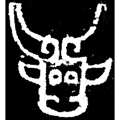
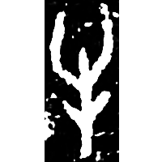
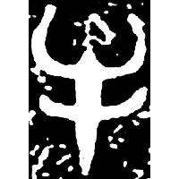
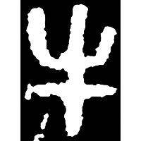
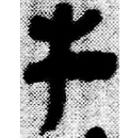
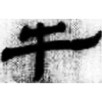
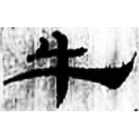
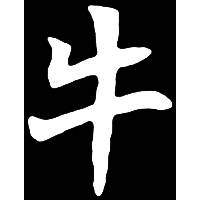
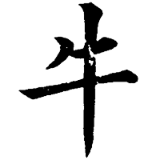

+++
radical = "93"
weight = 1
+++

| Shang | Shang (Shi) | Early W.Zhou | Middle W.Zhou | Qin | W.Han | E.Han | Nanbei (N.Wei) | Tang |
| ----- | ----- | ----- | ----- | ----- | ----- | ----- | ----- | ----- |
|  |  |  |  |  |  |  |  |  |
| 集2973 | 合2595 | 近二321 | 集2838A | 睡.種73 | 北.趙7 | 五.行231 | 寇憑墓誌 | 九經字樣 |

{牛}\*ŋʷə "cow"

Depiction of a cow's head.

- 季旭昇 2014 - 說文新證 \[2nd ed.\] (90-91)
