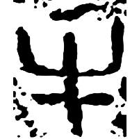
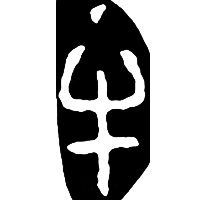
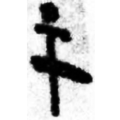
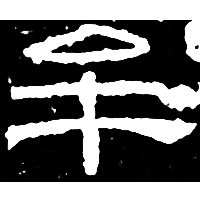
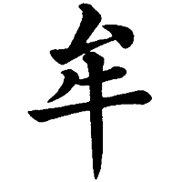

+++
radical = "93"
weight = 1
+++

| Zhanguo (Qin) | Qin | W.Han | E.Han | Nanbei (N.Wei) | Tang |
| ----- | ----- | ----- | ----- | ----- | ----- |
|  |  |  |  |  |  |
| 集10384 | 珍秦61 | 銀一899 | 孔龢碑 | 南0113X | 九經字樣 |

{牟} \*mu "moo"

Depiction of a cow ([牛](https://panatesu.github.io/glyph-origins/radicals/93/#U%2b725B)) with a dot/line over it, representing the sound coming from it.

- 黃德寬 (ed.) 2007 - 古文字譜系疏證 (735)
