+++
radical = "94"
weight = 1
+++

| Shang | Shang | Shang (Bin) | Shang (Wuming) | Shang (Wuming) | Middle W.Zhou | Chunqiu (Qin) | Qin | Han | E.Han | Nanbei (E.Wei) | Tang |
| ----- | ----- | ----- | ----- | ----- | ----- | ----- | ----- | ----- | ----- | ----- | ----- |
| 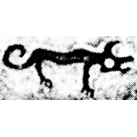 | 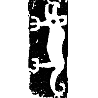 | 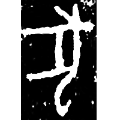 | 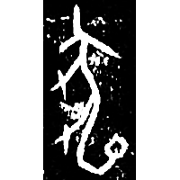 | 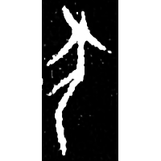 | 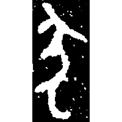 | 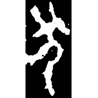 | 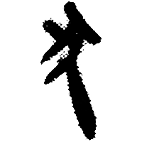 | 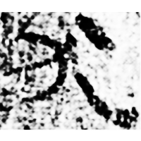 | 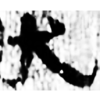 | 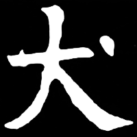 | 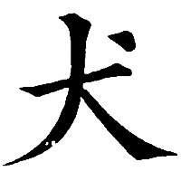 |
| 殷新229 | 集7525 | 合8979 | 合27926 | 合30510 | 集3976 [𤞷] | 石鼓.作原 [猶] | 嶽一.占42正 | 居新EPT51:576 | 五.行342 [狀] | 元寶建墓誌 | 五經文字 |

{犬} \*\[k\]ʷʰˤ\[e\]\[n\]ʔ "dog" & {狺} \*ŋ(r)ə\[n\] "bark"

Depiction of a dog. Initially it was used for both words {犬} and {狺}. Later it began to be used only for {犬}.

- 季旭昇 2014 - 說文新證 \[2nd ed.\] (750)
