+++
radical = "96"
weight = 1
+++

| Shang (Shi-Bin) | Shang (Bin) | Shang (Bin) | Early W.Zhou | Late W.Zhou | Qin | W.Han | Han | E.Han | Nanbei (N.Wei) | Tang | Ming |
| ----- | ----- | ----- | ----- | ----- | ----- | ----- | ----- | ----- | ----- | ----- | ----- |
| 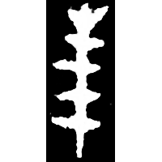 | 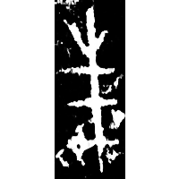 | 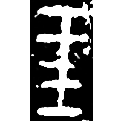 | 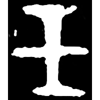 | 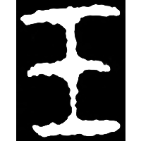 | 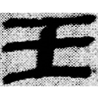 | 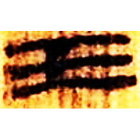 | 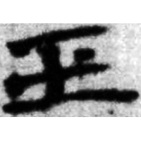 | 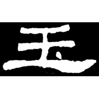 | 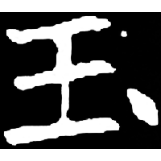 | 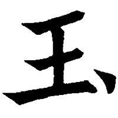 | 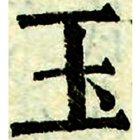 |
| 合3068 | 英1610正 | 合16089 | 集3712 | 集2841B | 睡.問140 | 北.老94 | 武醫85乙 | 史晨碑 | 長孫子澤墓誌 | 五經文字 | 字彙 |

{玉} \*ŋ(r)ok "jade"

Depiction of a bundle of jades. Later a differentiative dot was added to differentiate it from [王](https://panatesu.github.io/glyph-origins/radicals/96/#U%2b738B).

- 季旭昇 2014 - 說文新證 \[2nd ed.\] (54-55)

**Forms:**

[𠀛](https://panatesu.github.io/glyph-origins/radicals/1/#U%2b2001B) - Copy of a transmitted ancient form.
