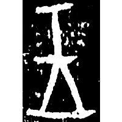
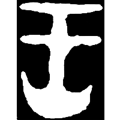
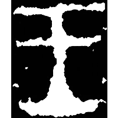
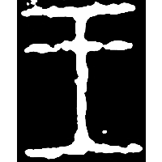
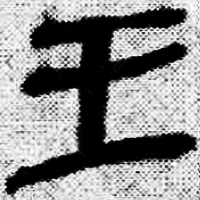
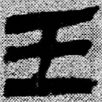
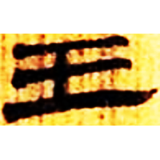
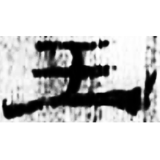
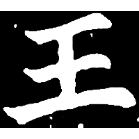

+++
radical = "96"
weight = 1
+++

| Shang (Li) | Early W.Zhou | Middle W.Zhou | Late W.Zhou | Qin | Qin | W.Han | E.Han | Nanbei (N.Wei) |
| ----- | ----- | ----- | ----- | ----- | ----- | ----- | ----- | ----- |
|  |  |  |  |  |  |  |  |  |
| 合33160 | 文物1998.9 | 文物2003.9 | 集4160 | 睡.問203 | 睡.日乙184 | 北.老209 | 五.行347 | 南0097X |

{王} \*\[w\]aŋ "king" & {士} \*\[dz\]rəʔ "knight"

[士](https://panatesu.github.io/glyph-origins/radicals/33/#U%2b58EB) + differentiative dot. Initially it was used for both words {王} and {士}. Later it began to be used only for {王}.

- 林澐 1965 - 說王
- 季旭昇 2014 - 說文新證 \[2nd ed.\] (51-53)
