+++
radical = "96"
weight = 1
+++

| Zhanguo (Chu) | Zhanguo (Chu) | Zhanguo (Chu) | Zhanguo (Chu) | Zhanguo (Chu) | Qin | W.Han | W.Han | E.Han | Nanbei (N.Wei) | Tang |
| ----- | ----- | ----- | ----- | ----- | ----- | ----- | ----- | ----- | ----- | ----- |
| 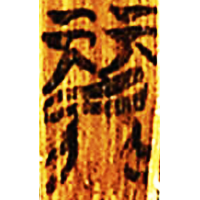 | 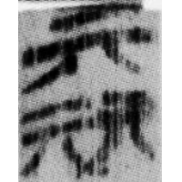 | 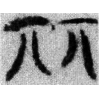 | 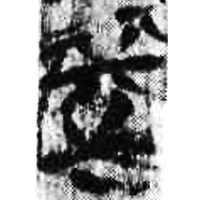 | 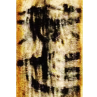 | 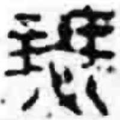 | 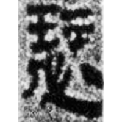 | 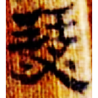 | 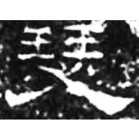 | 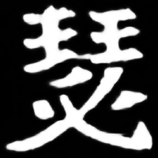 | 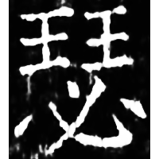 |
| 清一.尹誥2 [麗] | 望2.50 [麗] | 郭.六德30 [麗] | 包260 | 上二.容成2 | 封泥印8 | 謝家橋 | 水35 | 漢0026A | 南0256X | 開石.毛詩6 |

{瑟} \*\[sV.m\]ri\[t\] "*se* (musical instrument)"

Initially the word {瑟} was written as a shortened form of [麗](https://panatesu.github.io/glyph-origins/radicals/198/#U%2b9E97) \*RE. Later ♪[必](https://panatesu.github.io/glyph-origins/radicals/61/#U%2b5FC5) \*MIT was added.

- 郭永秉 2012 - 補說“麗”、“瑟”的會通——從《君人者何必安哉》的“⿰元元”字說起
- 陳劍 2015 - 說“規”等字並論一些特別的形聲字意符

  
