+++
radical = "97"
weight = 1
+++

| Shang (Shi) | Shang (Chu) | Shang (Li) | Shang | Middle W.Zhou | Qin | W.Han | Han | Han | Sanguo (Wei) | Tang | Ming |
| ----- | ----- | ----- | ----- | ----- | ----- | ----- | ----- | ----- | ----- | ----- | ----- |
| 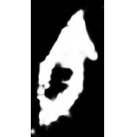 | 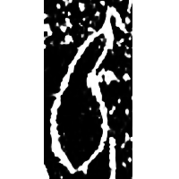 | 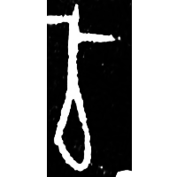 | 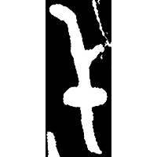 |  | 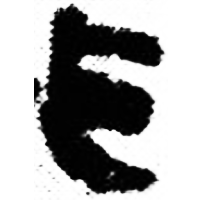 | 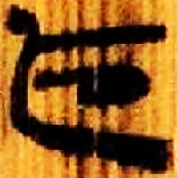 | 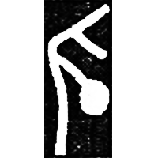 | 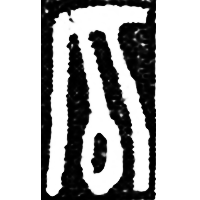 | 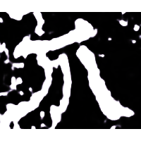 | 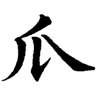 | 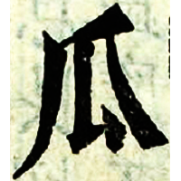 |
| 合21306乙 | 合23227 [𪾏] | 合33292 | 集9793 [孤] | 集4288.1 | 睡.爲2 [孤] | 北.蒼25 | 施玉575 [狐] | 虛3741 [狐] | 魏上尊號碑 | 五經文字 | 字彙 |

{瓜} \*kʷˤra "gourd" & {卣} \*lu(ʔ) "*you* vessel" & {匏} \*\[b\]ˤru "gourd"

Depiction of a gourd. Initially it was used for words {瓜}, {卣} and {匏}. Later it began to be used only for {瓜}.

- 陳劍 2020 - 釋“瓜”
