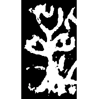
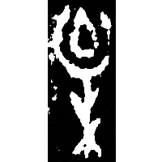
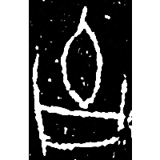
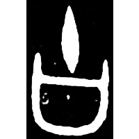
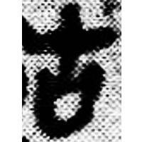
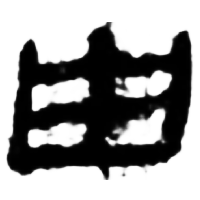
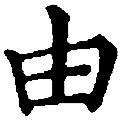

+++
radical = "102"
weight = 1
+++

| Shang (Bin) | Shang (Shi) | Shang (Wuming) | Shang (Shi) | Shang (Bin) | Early W.Zhou | Late W.Zhou | Qin | Han | W.Han | E.Han | Tang |
| ----- | ----- | ----- | ----- | ----- | ----- | ----- | ----- | ----- | ----- | ----- | ----- |
|  |  |  |  |  |  |  |  |  |  |  |  |
| 合8358 [⿰氵柚] | 合10954 [柚] | 合28164 [⿰柚尋] | 屯2691 | 合667正 | 集5769 | 集10176 [油] | 睡.種125 [軸] | 居新EPF22.11 [軸] | 北.淫22 [柚] | 熹經82 | 五經文字 |

{由} \*l\[u\] "from"

Shortened form of [柚](https://panatesu.github.io/glyph-origins/radicals/75/#U%2b67DA) (depiction of a pomelo tree with fruits).

- 王子楊 2013 - 釋甲骨文中的“柚”
- 鄔可晶 & 施瑞峰 2022 - 說“朕”“灷”
