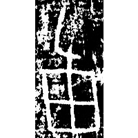
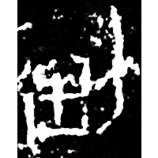
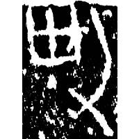
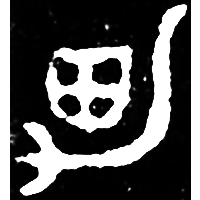
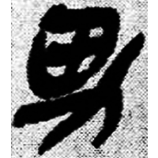
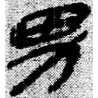
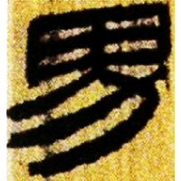
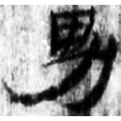
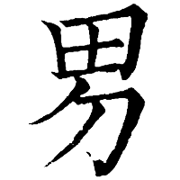

+++
radical = "102"
weight = 1
+++

| Shang (Shi-Bin) | Shang (Bin) | Shang (Bin) | Early W.Zhou | Qin | Qin | W.Han | E.Han | Nanbei (N.Wei) | Tang | Tang |
| ----- | ----- | ----- | ----- | ----- | ----- | ----- | ----- | ----- | ----- | ----- |
|  |  |  |  |  |  |  |  |  |  |  |
| 合3454 | 合3453 | 合補2544 | 集9901.1 | 睡.日乙83 | 睡.問167 | 北.蒼Z2 | 五.行85 | 王僧男墓誌銘 | 干祿字書 | 開石.禮記33 |

?{任} \*nəm "(physical) burden" ♪→ {男} \*nˤəm "baron; man"

Depiction of a plow ([力](https://panatesu.github.io/glyph-origins/radicals/19/#U%2b529B)) on a field ([田](https://panatesu.github.io/glyph-origins/radicals/102/#U%2b7530)).

- 季旭昇 2014 - 說文新證 \[2nd ed.\] (918-919)
