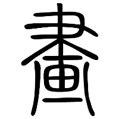
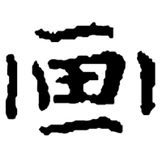
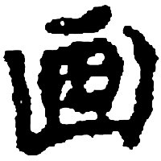
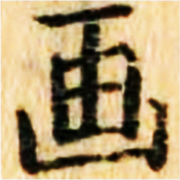

+++
radical = "102"
weight = 1
+++

| E.Han | S.Song | Yuan | Edo |
| ----- | ----- | ----- | ----- |
|  |  |  |  |
| 說文解字 | 六書故 | 太平樂府 | 繪本倭比事 |

Shortened form of [畫](https://panatesu.github.io/glyph-origins/radicals/102/#U%2b756B) to the lower part. Modern simplified form in China and Japan.

- Bökset R. 2021 - Long Story of Short Forms: Simplified Chinese Characters from A to Z (137)