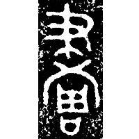
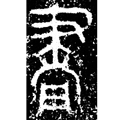
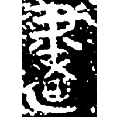
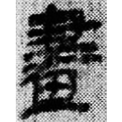
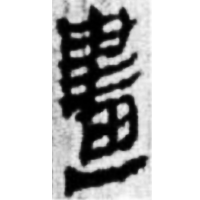
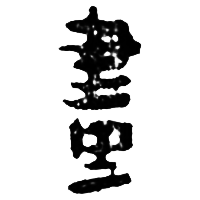
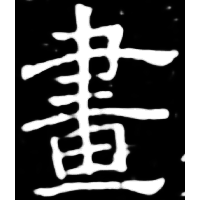
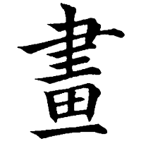

+++
radical = "102"
weight = 1
+++

| Middle W.Zhou | Late W.Zhou | Qin | Qin | W.Han | E.Han | Nanbei (N.Zhou) | Tang |
| ----- | ----- | ----- | ----- | ----- | ----- | ----- | ----- | ----- |
|  |  |  |  |  |  |  |  |
| 集3074 | 集4216.2 | 集4468 | 秦新356 | 睡.爲1 | 馬.遣一178 | 華夏考古1987.2 | 南0624X | 五經文字 |

{畫} \*ɡʷˤrek "to draw"

[周](https://panatesu.github.io/glyph-origins/radicals/30/#U%2b5468) *ENGRAVE*(?) + ♪[𬚪](https://panatesu.github.io/glyph-origins/radicals/129/#U%2b2C6AA) \*GᵂEK ([聿](https://panatesu.github.io/glyph-origins/radicals/129/#U%2b807F) *BRUSH* + ♪[乂](https://panatesu.github.io/glyph-origins/radicals/4/#U%2b4E42)² \*KᵂE(K) for {畫}).

- 金祥恒 1971 - 說卜辭中之子畫
- 孫常敘 1982 - 則、灋度量則、則誓三事試解》
- 李守奎 2016 - 釋楚簡中的「規」――兼說「支」亦「規」之表意初文
- 陳劍 2017 - 說「規」等字並論一些特別的形聲字意符

**Forms:**

[画](https://panatesu.github.io/glyph-origins/radicals/102/#U%2b753B) - Shortening to the lower part. Modern simplified form in China and Japan.
