+++
radical = "103"
weight = 1
+++

| Shang (Bin) | Shang (Li) | Shang (Bin) | Early W.Zhou | Late W.Zhou | Qin | Qin | W.Han | Han | E.Han | Nanbei (N.Qi) | Tang |
| ----- | ----- | ----- | ----- | ----- | ----- | ----- | ----- | ----- | ----- | ----- | ----- |
| 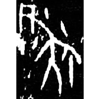 | 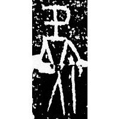 | 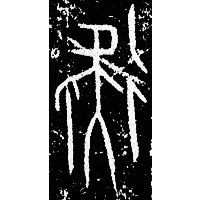 | 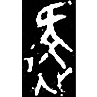 | 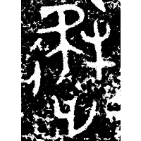 | 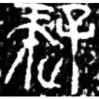 | 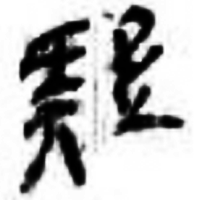 | 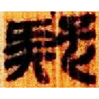 | 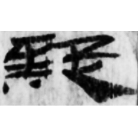 | 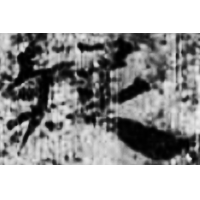 | 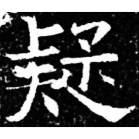 | 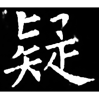 |
| 合13465 [𠤗] | 合32908 [𠤗] | 合12532正 [⿰彳𠤗] | 集4059 [⿰彳𠤗>] | 集6490 [⿺辶⿰𠤕牛>] | 秦銘147 | 嶽三J56 | 北.蒼71 | 居40.6 | 五.行84 | 高淯墓誌 | 開石.禮記9 |

?{㘈} \*\[ŋ\](r)ək "smart child" ♪→ {疑} \*\[ŋ\](r)ə "to doubt"

Initally the word {疑} was written as [𠤗](https://panatesu.github.io/glyph-origins/radicals/21/#U%2b20917) (depiction of a person with a cane (\> 止) looking around); sometimes [彳](https://panatesu.github.io/glyph-origins/radicals/60/#U%2b5F73) *ROAD* and ♪[牛](https://panatesu.github.io/glyph-origins/radicals/93/#U%2b725B) \*ŊᵂƏ were added. The modern glyph comes either from [子](https://panatesu.github.io/glyph-origins/radicals/39/#U%2b5B50) *CHILD* + ♪[𠤗](https://panatesu.github.io/glyph-origins/radicals/21/#U%2b20917) \*ŊƏ for the word {㘈} or from the distortion [牛](https://panatesu.github.io/glyph-origins/radicals/93/#U%2b725B) \> 子.

- 陳志向 2017 - 利用古文字資料研究《說文》諧聲及相關問題
- 顧王樂 2020 - 清末民國時期利用古文字資料校證《說文》之研究
- 石繼承 2021 - 漢印文字研究
