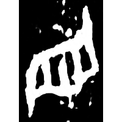
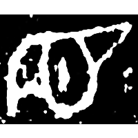
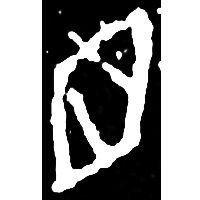
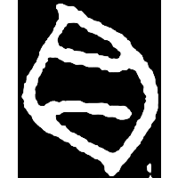
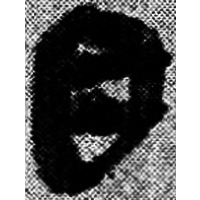
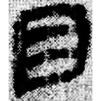
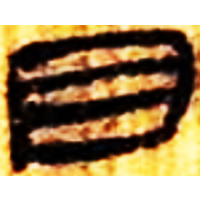
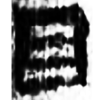

+++
radical = "109"
weight = 1
+++

| Shang (Shi) | Shang (Bin) | Shang (Bin) | Shang (Wuming) | Middle W.Zhou | Zhanguo (Qin) | Qin | Qin | W.Han | E.Han | Nanbei (N.Wei) | Tang |
| ----- | ----- | ----- | ----- | ----- | ----- | ----- | ----- | ----- | ----- | ----- | ----- |
|  |  |  |  |  |  |  |  |  |  |  |  |
| 合22317 [𬙜] | 合6194 | 合13626 | 合28374 | 集2678 [䀝] | 秦銘90 | 睡.日乙240 | 睡.爲39 | 北.老151 | 五.木牘282 [相] | 南0091X | 五經文字 |

{目} \*CV.mək "eye"

Depiction of an eye.

- 季旭昇 2014 - 說文新證 \[2nd ed.\] (261-262)

  
