+++
radical = "109"
weight = 1
+++

| Shang | Shang (Shi-Bin) | Early W.Zhou | Late W.Zhou | Qin | Qin | W.Han | Han | E.Han | Han | Nanbei (N.Wei) | Tang |
| ----- | ----- | ----- | ----- | ----- | ----- | ----- | ----- | ----- | ----- | ----- | ----- |
| 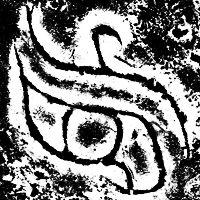 | 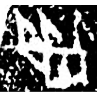 |  | 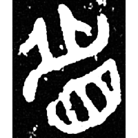 | 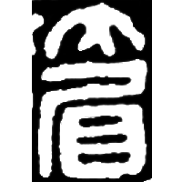 | 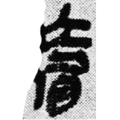 | 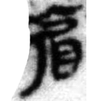 | 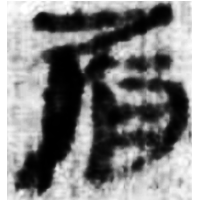 | 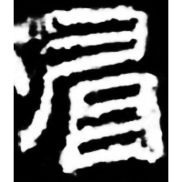 | 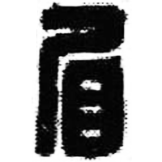 | 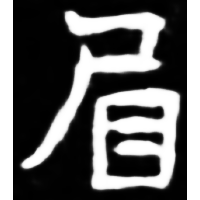 | 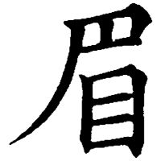 |
| 銘圖3 | 合3421 | 集4238.2 | 集4331 | 秦風66 [媚] | 睡.日乙246 [媚] | 馬.繫辭36下 [楣] | 居新EPT57:69A | 熹經414 [楣] | 漢徵12.13 | 南0261X | 五經文字 |

{眉} \*rməj "eyebrow"

Depiction of an eye ([目](https://panatesu.github.io/glyph-origins/radicals/109/#U%2b76EE)) with the eyebrows.

- 季旭昇 2014 - 說文新證 [2nd ed.] (270-271)
