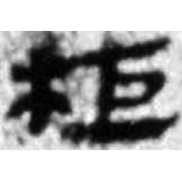
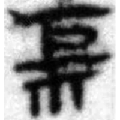
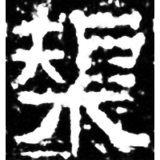
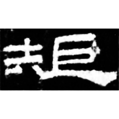
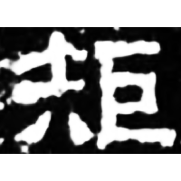
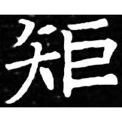

+++
weight = 1
radical = "111"
+++

| W.Han | W.Han | E.Han | E.Han | Sanguo (Wei) | Nanbei (E.Wei) |
| ----- | ----- | ----- | ----- | ----- | ----- |
|  |  |  |  |  |  |
| 馬.十14下 [柜] | 馬.要13下 [𭩢] | 北海相景君銘 [榘] | 淮源廟碑 | 魏孔子廟碑 | 南0466X |

{矩} \*kʷ(r)aʔ "carpenter's square"

Shortened form of [榘](https://panatesu.github.io/glyph-origins/radicals/75/#U%2b6998). Initially the morpheme {矩} from the word {規矩} \*kʷe kʷ(r)aʔ "rule" was usually written as [柜](https://panatesu.github.io/glyph-origins/radicals/75/#U%2b67DC) or [𭩢](https://panatesu.github.io/glyph-origins/radicals/75/#U%2b2DA62) ([木](https://panatesu.github.io/glyph-origins/radicals/75/#U%2b6728) *TREE* + ♪[巨](https://panatesu.github.io/glyph-origins/radicals/48/#U%2b5DE8) \*KA), but later it got assimilated with [規](https://panatesu.github.io/glyph-origins/radicals/147/#U%2b898F) via adding its element 夫 (見 could also be added).

- 陳劍 2015 - 說“規”等字並論一些特別的形聲字意符
- 于淼 2015 - 漢代隸書異體字表與相關問題研究 [part 2] 漢代隸書異體字表 (203)